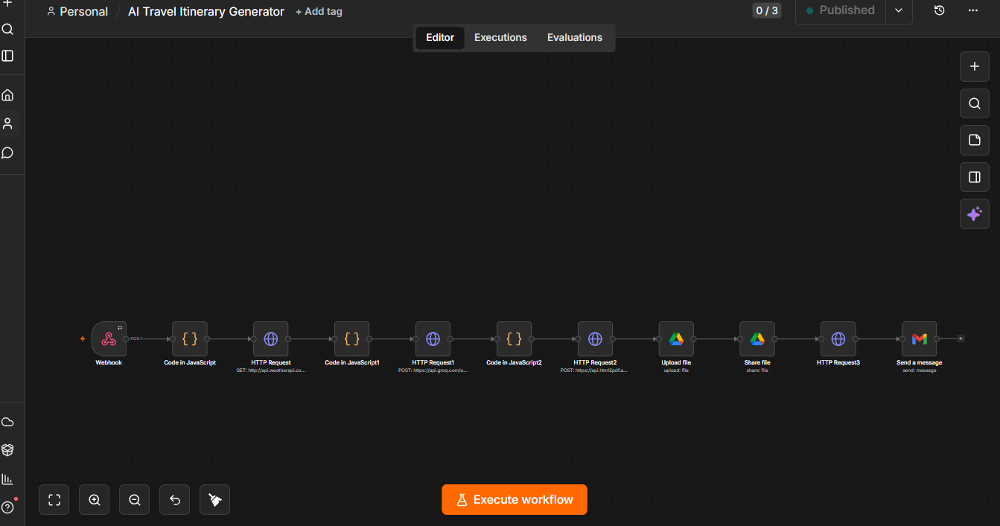
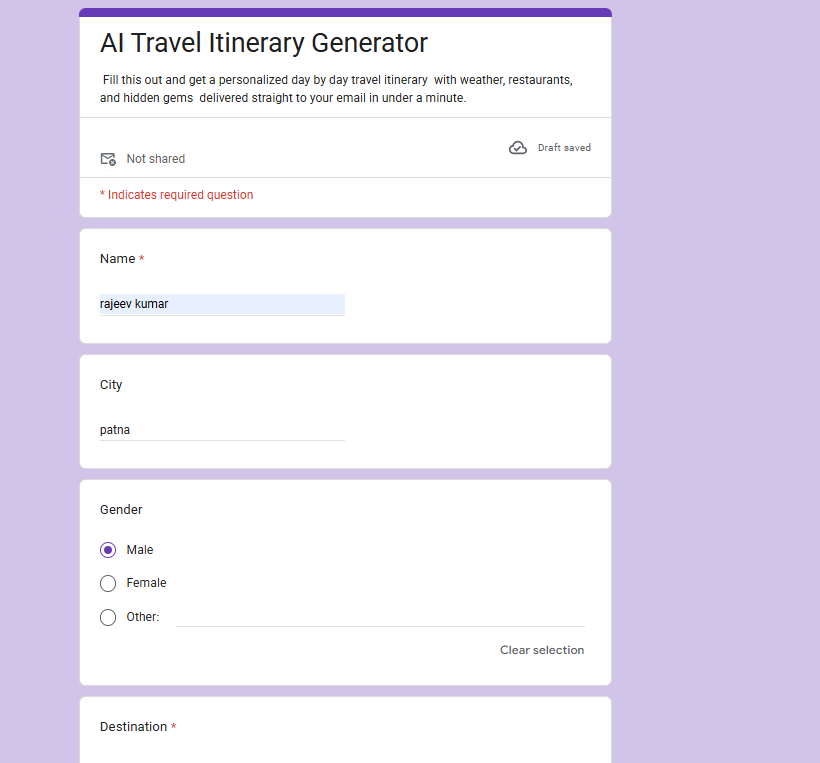
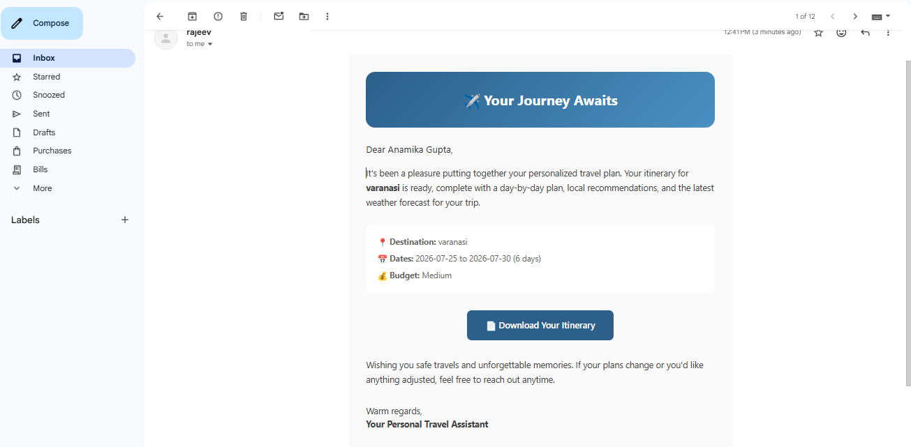

# ✈️ AI Travel Itinerary Generator

A free, fully automated workflow that turns a simple form submission into a personalized, AI-generated travel itinerary — complete with real weather data, restaurant recommendations, and hidden gems — delivered as a polished PDF straight to your inbox in under a minute.

## How It Works

```
Google Form → Apps Script → n8n Webhook → Trip Duration Calculator
→ Weather Forecast (WeatherAPI) → AI Itinerary Generation (Groq)
→ Styled HTML Build → PDF Conversion → Google Drive Upload
→ Public Sharing Permissions → Personalized Email (Gmail)
```

1. **User fills out a Google Form** with their name, destination, travel dates, budget, interests, and email
2. **Google Apps Script** captures the submission and sends it to an n8n webhook
3. **n8n workflow** takes over:
   - Calculates total trip duration
   - Fetches a real weather forecast for the destination
   - Sends trip details + weather to **Groq's free LLM API** to generate a detailed, day-by-day itinerary (morning/afternoon/evening breakdown, restaurant picks, activity costs, hidden gems, budget summary)
   - Builds a fully styled HTML document
   - Converts it to a PDF
   - Uploads the PDF to Google Drive and sets it to "anyone with the link can view + download"
   - Sends a warm, personalized email with the download link

## Screenshots

### The n8n Workflow


### The Google Form


### The Result — Personalized Email


## Tech Stack

| Tool | Purpose | Cost |
|---|---|---|
| [Google Forms](https://forms.google.com) | User input collection | Free |
| [Google Apps Script](https://script.google.com) | Connects Form → n8n webhook | Free |
| [n8n](https://n8n.io) | Workflow automation engine | Free (cloud trial / self-hosted) |
| [WeatherAPI.com](https://weatherapi.com) | Real weather forecast data | Free tier |
| [Groq](https://console.groq.com) | Free, fast LLM inference (Llama 3.3 70B) | Free |
| [html2pdf.app](https://html2pdf.app) | HTML → PDF conversion | Free tier |
| Google Drive + Gmail | File storage & email delivery | Free |

**Total cost to run:** effectively $0.

## Setup Instructions

### 1. Google Form
Create a form with these fields: Name, City, Gender, Destination, Start Date, End Date, Budget (multiple choice), Interests (checkboxes), Email (with email validation).

### 2. Apps Script Connector
In your form's **Extensions → Apps Script**, add a script that captures `onFormSubmit` and POSTs the response as JSON to your n8n webhook URL. Set a trigger: **From form → On form submit**.

### 3. Import the n8n Workflow
- Import [`ai-travel-itinerary-workflow.json`](./ai-travel-itinerary-workflow.json) into your n8n instance
- Replace the placeholder values with your own free API keys:
  - `YOUR_WEATHERAPI_KEY_HERE` → your WeatherAPI.com key
  - `YOUR_GROQ_API_KEY_HERE` → your Groq API key
  - `YOUR_HTML2PDF_API_KEY_HERE` → your html2pdf.app key
- Connect your own Google Drive and Gmail credentials in the respective nodes
- Publish the workflow and copy the **Production webhook URL** into your Apps Script

### 4. Test
Submit a real response through your live Google Form and check your inbox.

## Example Output

The generated itinerary includes:
- A styled cover section with trip details
- Day-by-day weather forecast cards
- Morning / Afternoon / Evening breakdown per day
- Restaurant suggestions with approximate costs
- 1–2 hidden gem recommendations per day
- A budget summary table

## Notes

- WeatherAPI's free tier forecasts up to a limited number of days ahead — longer trips will show partial forecast data
- This project was built as a learning exercise in no-code automation and AI-assisted workflows

---

Built with n8n, Groq, and a lot of debugging. 🚀

## 🧑‍💻 Author

<p align="center"><b>Rajeev Kumar</b></p>

<p align="center">
  <a href="https://github.com/21f3001527">
    
  </a>
  <a href="https://www.linkedin.com/in/rajeev245/">
    
  </a>
  
</p>

Feel free to reach out if you have questions about this project!
